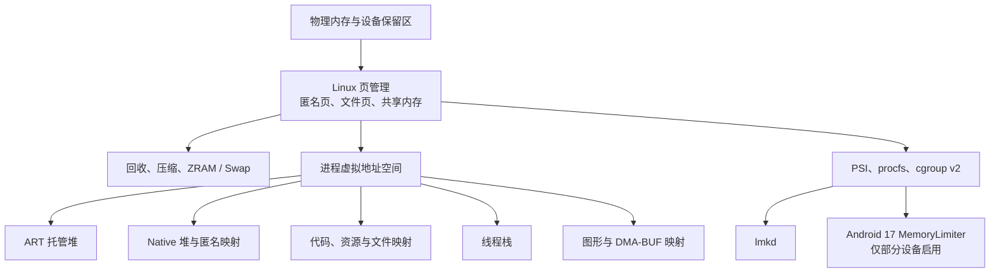
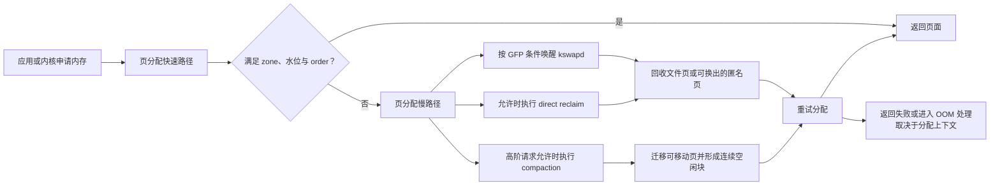
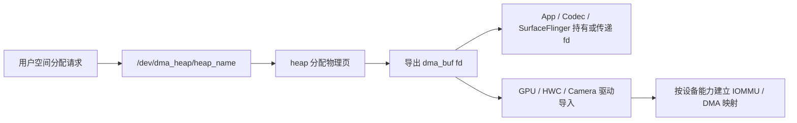

# Android 与 Linux 内存管理全景

Android 进程看到 Java Heap、Native Heap、图形内存和文件映射，内核最终以页、匿名内存、文件页和 swap 管理这些占用。分析 PSS、RSS、回收和 OOM 时，需要把应用视角与内核视角对应起来。

## 进程内存域与统计口径

### 先建立一张可用于排障的地图

Android 应用遇到的“内存问题”至少有四类：

- Java 或 Kotlin 代码分配对象时，Android Runtime（ART）无法满足请求并抛出内存不足（Out of Memory，OOM）异常 `OutOfMemoryError`（OOME）；
- 原生内存分配器、图形驱动或其他系统调用返回分配失败；
- 系统处于内存压力中，低内存终止守护进程（lmkd）按进程重要性和内存占用选择目标；
- Android 17 的部分设备启用了内存限制器（MemoryLimiter），单个应用的匿名内存与交换空间（Swap）越过厂商配置的上限。

这几类问题的触发条件、证据和处理方向各不相同。只看一个按共享页比例分摊的 PSS 数字，很难判断是哪一类。排查时应沿着“系统是否有压力、进程用了什么、哪一类对象或映射在增长、进程怎样退出”逐层缩小范围。

Android 开源项目（AOSP）的 `android-17.0.0_r1`（Android 17 / API 37）是平台源码锚点，内核语义以 `android17-6.18-2026-06_r6` 为锚点。设备厂商可以调整 ZRAM 块设备（用于在 RAM 中保存压缩数据）、控制组（cgroup）、图形驱动和进程限制，因此节点与数值仍以目标设备为准。

排查过程涉及以下层次：



图中的箭头表示管理或记账关系。procfs 是以 `/proc` 挂载、用于暴露进程和内核状态的虚拟文件系统；cgroup v2 用于按进程组统计和限制资源。ART 堆、原生堆和图形内存最终都依赖内核提供的页面、映射或设备缓冲区；同一物理页还可能被多个进程和设备共享。

### 从物理内存到进程地址空间

#### 物理内存并不等于应用可用内存

设备标称的物理内存（RAM）、Linux 的 `/proc/meminfo` 中 `MemTotal`、应用可以持续占用的内存是三个不同口径。

- 固件、内核映像、页表、内核对象和硬件保留区会消耗一部分物理内存。
- 文件页缓存会占用 RAM，但其中的干净页通常可以回收。
- 匿名页可以留在 RAM，也可以在配置允许时进入 ZRAM 或其他交换后端。
- 图形、相机和编解码缓冲区可能通过 DMA-BUF 共享缓冲区机制在进程与硬件之间共享；具体记账取决于内核、驱动和内存跟踪接口（memtrack）的实现。
- Android 会保留运行系统服务和前台体验所需的余量，应用无法把 `MemTotal` 当作自己的预算。

因此，`MemFree` 很小并不必然表示系统异常。Linux 会利用空闲页做缓存。判断系统余量时，`MemAvailable` 比 `MemFree` 更有参考价值；判断压力是否已经影响任务运行，还要看内存压力停顿信息（memory PSI）、回收活动和进程退出记录。

#### 虚拟地址空间只是地址，不等于已占用的 RAM

64 位应用拥有很大的虚拟地址空间。`mmap`、加载 `.so`、预留线程栈或为堆保留地址范围，都会增加虚拟大小；只有被访问并驻留的页才进入 RSS。页还可能是共享的、可回收的或已经换出。

一个 Android 进程常见的映射来源如下：

| 区域 | 常见来源 | 观察时要注意 |
|---|---|---|
| ART 托管堆 | Java/Kotlin 对象、对象数组、部分运行时结构 | 堆容量、已分配对象、活对象和 PSS 口径不同 |
| 原生堆 | `malloc`/`new`、Java 原生接口（JNI）、C/C++ 库 | Java HPROF 堆转储看不到原生内存分配 |
| 匿名映射 | `mmap(MAP_ANONYMOUS)`、运行时空间、即时编译（JIT）区域等 | 不一定归入 `Native Heap` |
| 代码与资源映射 | APK、`.dex`、`.vdex`、`.oat`、`.art`、`.so`、字体 | 干净文件页可回收，共享页会按 PSS 分摊 |
| 线程栈 | 主线程栈、POSIX 线程（pthread）/ART 创建的线程栈 | 预留地址范围和已经访问的页面差距可能很大 |
| 共享内存 | `memfd`、早期 Android 使用的 ashmem、Binder 进程间通信共享区域等 | 同一物理页可以出现在多个进程 |
| 图形与设备内存 | Android 图形缓冲区分配器 Gralloc、DMA-BUF、EGL/OpenGL/Vulkan 图形栈、驱动对象 | 进程映射、memtrack 与设备侧占用可能采用不同口径 |

`ActivityManager.getMemoryClass()` 返回的是平台根据 `dalvik.vm.heapgrowthlimit`（没有该属性时回退到 `dalvik.vm.heapsize`）给出的托管堆近似容量，单位为 MiB，即 `2^20` 字节。它不是进程总内存上限，也不覆盖原生内存、代码映射、线程栈和图形内存。`largeHeap` 对应的容量也由设备配置决定，不能写成固定值。

线程栈也不能统一记成“每线程 1 MiB 已用内存”。AOSP Android 17 的 ART `Thread::FixStackSize()` 会根据请求值、运行时默认值、保护区和运行环境修正栈映射；主线程还继承进程启动时创建的栈。栈映射的 VSS 与已访问页面形成的 RSS 应分别观察。

### VSS、RSS、PSS、USS 各回答什么问题

#### 四个指标的定义

| 指标 | 含义 | 适合回答的问题 | 主要限制 |
|---|---|---|---|
| VSS / VmSize | 虚拟集大小（Virtual Set Size）；进程虚拟地址空间中所有映射的总大小 | 地址空间是否异常、是否存在超大预留或映射 | 大量页面可能从未驻留，不能当作物理占用 |
| RSS | 驻留集大小（Resident Set Size）；当前驻留在 RAM 的页面总量 | 进程此刻访问了多少驻留页 | 共享页会在每个映射进程中重复计算 |
| PSS | 比例分摊集大小（Proportional Set Size）；每个驻留共享页按映射者数量分摊后求和 | 多进程之间较公平的内存归因 | 共享者变化会让 PSS 波动，采集需要遍历页映射 |
| USS | 独占集大小（Unique Set Size）；通常以 `Private_Clean + Private_Dirty` 估算私有驻留页 | 进程私有驻留规模 | 不等于终止进程后立即增加的可用内存 |

对同一时刻、同一进程和相近工具口径，通常可以使用下面的关系做直觉检查：

`VSS ≥ RSS ≥ PSS ≥ USS`

这条关系不能替代字段定义。`SwapPss` 是换出共享页的比例分摊值；工具是否计入 `SwapPss`、设备内存、显式大页（HugeTLB）或 memtrack 数据，会改变最终展示口径。

#### 为什么 PSS 会在代码不变时波动

假设三个进程映射了同一个 12 MiB 的驻留共享区域，每个进程先分到约 4 MiB PSS。如果其中两个进程退出，剩余进程会分到约 12 MiB。剩余进程的对象和映射没有增长，PSS 仍然可能上升。

所以判断泄漏时，应在可重复的业务阶段采样，并同时观察：

- RSS、PSS、私有脏页（`Private Dirty`）、`SwapPss` 的趋势；
- Java 对象、原生内存分配或 DMA-BUF 等具体组成；
- 共享进程是否启动或退出；
- GC、页面回收和前后台切换的时间点。

“PSS 连续上升”是继续调查的信号，还不是泄漏结论。

#### USS 不等于“终止进程后能释放多少”

私有干净页可直接丢弃，私有脏页需要回收或释放；共享页在进程退出后会重新分摊；文件描述符关联的内核对象、图形缓冲区和服务端引用也有各自生命周期。USS 适合描述私有驻留规模，无法精确预测进程退出后的 `MemAvailable` 增量。

### 用 procfs 查看原始证据

#### `/proc/meminfo`：系统级快照

先采集系统总量、可用量、匿名页、文件缓存与交换空间。下面的命令只筛选常用字段，单位由节点输出决定，通常为 kB。

```bash
adb shell 'cat /proc/meminfo | grep -E "^(MemTotal|MemFree|MemAvailable|Buffers|Cached|SReclaimable|Shmem|AnonPages|SwapTotal|SwapFree|SwapCached):"'
```

这些字段要结合起来读。`Cached` 较大通常说明 RAM 被文件页利用；`SwapFree` 下降说明逻辑交换空间在消耗；`SwapCached` 表示已经换入、同时仍在交换空间保留副本的页面，不能拿来代替 ZRAM 设备占用。

#### `/proc/<pid>/status`：低成本进程概览

下面的命令用于快速检查目标进程的地址空间、RSS 分项、交换空间与线程数。

```bash
adb shell 'pid=$(pidof com.example.app); grep -E "^(VmSize|VmRSS|RssAnon|RssFile|RssShmem|VmSwap|VmStk|Threads):" /proc/$pid/status'
```

`VmRSS` 对应驻留集概览，通常可拆分为 `RssAnon`、`RssFile` 和 `RssShmem`。Linux 内核文档提醒，`status` 中部分 RSS 统计通过异步记账获得，精确度低于 `smaps` 汇总。`VmStk` 描述主栈映射大小，不表示主线程已经使用的栈字节数。

Android 的 SELinux 强制访问控制、procfs 挂载选项和进程跟踪（ptrace）权限会限制跨进程读取。开发机上可以根据构建类型和应用属性使用 `run-as`、应用自身采集或具备权限的系统工具；量产设备上不要假定 `adb shell` 能读取任意 PID 的 `smaps`。

#### `/proc/<pid>/smaps` 与 `smaps_rollup`：逐映射核算

`smaps` 为每个虚拟内存区域（Virtual Memory Area，VMA）提供 `Size`、`Rss`、`Pss`、私有/共享的干净页与脏页、Swap 等字段。`smaps_rollup` 在内核支持时给出进程汇总，输出更短，但仍需要内核遍历相关映射和页面。

下面的命令用于查看进程汇总：

```bash
adb shell 'pid=$(pidof com.example.app); cat /proc/$pid/smaps_rollup'
```

`smaps_rollup` 适合快速比较进程汇总值，但不能指出增长来自哪一个映射。

下面的命令用于定位 PSS 较大的具体映射：

```bash
adb shell 'pid=$(pidof com.example.app); cat /proc/$pid/smaps' > app.smaps
```

第二条命令把输出保存到主机当前目录，适合离线解析。频繁轮询 `smaps` 会增加 CPU 开销并扰动观测，应根据问题选择采样间隔。

#### 4 KiB 与 16 KiB 页大小

Android 15 起，AOSP 支持使用 16 KiB 页大小的设备。Android 17 排查内存时，不应默认页大小是 4 KiB。下面的命令可直接读取运行设备的页大小：

```bash
adb shell getconf PAGE_SIZE
```

`smaps` 还会列出 `KernelPageSize` 和 `MMUPageSize`。兼容映射和设备实现会影响具体输出，因此分析脚本应读取字段，避免把 4096 写死。

16 KiB 页会改变页表规模、缺页行为、对齐要求和小映射的内部碎片。官方文档只给出“平均内存可能略有增加”这类边界描述，没有通用的固定增幅。应用比较前后数据时，应保持 ABI、构建选项、MTE、业务负载和设备配置一致。

### `dumpsys meminfo` 应该怎样读

#### 先确认命令和采样条件

下面的命令采集指定包名对应进程的内存快照：

```bash
adb shell dumpsys meminfo com.example.app
```

包可能拥有多个进程。输出前先确认 PID、进程名、前后台状态和业务阶段；需要比较时，使用同一操作脚本、相近的等待时间和相同构建配置。

#### App Summary 是分类视图

AOSP Android 17 的 `Debug.MemoryInfo` 将 App Summary 组织为以下字段：

- `Java Heap`：`dalvikPrivateDirty` 加 `.art` 映射的私有页；
- `Native Heap`：原生堆的私有脏页（Private Dirty）；
- `Code`：`.so`、`.jar`、`.apk`、`.ttf`、`.dex`、`.oat` 等映射的私有页；
- `Stack`：栈类别的私有脏页；
- `Graphics`：`Gfx dev`、`EGL mtrack` 与 `GL mtrack` 汇总；
- `Private Other`：总私有页扣除前面几项后的余量；
- `System`：总 PSS 扣除总私有页后的余量，包含共享页的比例归因；内核提供 SwapPss 时也会受到比例化 Swap 的影响；
- `TOTAL PSS` 与 `TOTAL SWAP`：该次采样的 PSS 和 Swap 汇总。

这组分类由 `Debug.MemoryInfo` 的计算方式定义，不能逐项理解为独立的物理内存池。例如，`Java Heap` 采用私有页口径，`TOTAL PSS` 还包含共享页的比例归因。

#### 详细表格用于解释“增长来自哪里”

详细表格中的 `Dalvik Heap`、`Native Heap`、`.so mmap`、`.dex mmap`、`.art mmap`、`Stack`、`Ashmem`、`Memfd`、`EGL mtrack` 等行，来自内核映射分类和 memtrack 数据。

分析两次快照时，建议按以下顺序：

1. 确认 PID 和场景一致，记录采样时间与应用状态。
2. 比较 `TOTAL PSS`、RSS、SwapPss/Swap 的总体变化。
3. 找到变化最大的分类行。
4. 按分类切换工具：Java HPROF、原生堆分析器、`smaps`、DMA-BUF/图形工具或 Perfetto。
5. 在应用回到稳定状态后重复多轮，验证增长是否可复现。

`Objects` 区域里的 View、Activity、Binder、Parcel 等计数适合发现异常线索。一次计数偏高无法证明泄漏；需要结合对象保留路径、生命周期和重复场景判断。

#### 图形内存需要跨进程、跨驱动核对

Android 17 的 `getSummaryGraphics()` 只汇总 `Gfx dev`、`EGL mtrack` 和 `GL mtrack`。memtrack 数据是否完整取决于设备实现。Vulkan、Gralloc、DMA-BUF 和 SurfaceFlinger 持有的缓冲区还可能在其他节点或进程中记账。

排查图形增长时可以组合使用：

- `dumpsys meminfo`：查看进程视角的映射和 mtrack 分类；
- `dumpsys SurfaceFlinger`：查看合成层与缓冲区相关状态；
- `/proc/<pid>/smaps`：定位设备映射与共享映射；
- `/proc/<pid>/dmabuf_rss`：仅部分 Android 内核提供，且可能需要额外权限；
- Perfetto 与厂商 GPU 工具：观察分配、提交、回收和进程状态的时间关系。

`dumpsys gfxinfo` 主要提供 UI 渲染性能、帧与部分对象统计，无法完成图形内存的整体核算。

#### Ashmem、memfd 与 DMA-BUF 的职责要分开

ashmem 是 Android 早期的匿名共享内存机制，memfd 则通过文件描述符创建匿名内存对象；较新版本逐步使用 memfd 承担通用共享内存场景。DMA-BUF 面向设备之间以及设备与进程之间的缓冲区共享，常见于图形、相机和媒体。三者职责不同，不能用“DMA-BUF 取代 ashmem”概括版本变化。

### 堆转储与采样边界

#### Java HPROF 回答对象保留问题

需要分析 Java/Kotlin 对象、类实例数和引用链时，可以对允许调试的目标进程采集 ART 托管堆。下面的命令把 HPROF 堆转储写入设备临时目录，并在转储前请求 GC：

```bash
adb shell am dumpheap -g com.example.app /data/local/tmp/app.hprof
adb pull /data/local/tmp/app.hprof
```

AOSP Android 17 的 `ActivityManagerShellCommand.runDumpHeap()` 把 `-g` 解析为 `runGc=true`，再交给活动管理服务（ActivityManagerService，AMS）与应用进程执行。转储会暂停进程、遍历堆并额外消耗内存，低余量现场可能被它明显扰动。应先保留退出原因、日志、PSS/RSS 和时间线，再评估是否适合抓取 HPROF。

同一命令的 `-n` 选择原生堆转储，`-m` 请求 `malloc` 信息；它们的输出不是 Java HPROF，不能直接按 Java 对象图读取。原生内存分配应使用 Perfetto `android.heapprofd`、`malloc` 调试或厂商工具，具体选择取决于构建与权限。

#### Perfetto Java 堆分析器的适用范围

Perfetto 的 `android.java_hprof` 可把 ART 堆图写入跟踪文件，并支持按进程名或 PID 选择目标。连续快照会产生显著开销和较大的跟踪文件，通常先采单次快照，再根据复现窗口决定是否启用 `continuous_dump_config`。

Android 14 及以后还可以使用 `android.java_hprof.oom` 捕获 `OutOfMemoryError`（OOME）触发的堆信息；Android 17 的 Perfetto 服务源码仍注册了该数据源。是否能够采集目标应用，受应用可分析属性、系统配置和权限限制。

### 系统内存压力、控制组与进程退出

#### `MemAvailable` 与 PSI 描述不同维度

`MemAvailable` 估算在不发生交换的前提下，可供新应用使用的内存。PSI 记录任务因为等待内存资源而停顿的时间比例。下面的命令用于查看设备当前的内存压力停顿：

```bash
adb shell cat /proc/pressure/memory
```

`some` 表示至少有一个任务受影响，`full` 表示所有非空闲任务都因该资源同时停顿。短时尖峰和持续高压的含义不同，应把 PSI 与 `vmstat`、ZRAM、页面回收、业务卡顿和 lmkd 事件放在同一时间线上。

#### cgroup v2 的几个内存控制文件

控制组用于把一组进程放在共同的资源统计和限制边界内。Linux 6.18 的 cgroup v2 内存控制器为每个层级提供以下文件：

| 文件 | 内核语义 |
|---|---|
| `memory.low` | 尽力保护边界；低于有效边界的内存受到较少回收 |
| `memory.high` | 节流边界；越界任务进入直接回收并可能被节流，本身不调用内核的 OOM 进程终止机制（OOM killer） |
| `memory.max` | 硬上限；回收无法满足时可能触发该 cgroup 内的 OOM 处理 |
| `memory.current` | 当前内存用量 |
| `memory.stat` | 匿名页、文件页、共享内存（shmem）、回收等分类统计 |
| `memory.events` | `low`、`high`、`max`、`oom`、`oom_kill` 等事件计数 |
| `memory.swap.current` | 当前交换空间使用量 |
| `memory.swap.max` | 交换空间硬上限；达到后不再允许该 cgroup 继续换出匿名页 |
| `memory.pressure` | 该 cgroup 的内存 PSI |

Android 通过 `libprocessgroup` 与任务配置文件（task profile）管理进程所在的 cgroup。设备可以采用不同控制器和层级配置；定位时应读取该构建的 `cgroups.json`、`task_profiles.json` 以及运行设备的 cgroup 文件系统，避免凭版本号推断固定路径。

#### Android 17 MemoryLimiter：只在部分设备生效

Android 17 引入面向单应用的 MemoryLimiter 行为变化。它由 `system_server` 中的 Java 服务和 JNI 组件组成，使用每进程 cgroup v2 监控应用进程；它不是 `Runtime.maxMemory()` 或 Dalvik/ART heap size 调整，而是进程外部的 cgroup 边界。Java 堆之外的原生匿名映射、WebView/Bitmap 背后占用和图形相关缓存，只要最终表现为受统计的匿名页、共享内存或 Swap 增长，也可能把进程推近限制。 [来源: 技术文章/source/juejin-android/2026-09-11-76535333-解读 Android 17 全新内存限制，有没有.md] [已验证: Android 17 Memory Limiter 官方文档；AOSP android-17.0.0_r1 `MemoryLimiter.java` 与 JNI]

在 `android-17.0.0_r1` 源码锚点下，默认配置文件路径为 `/vendor/etc/memory-limiter-config.xml`；该文件并非必需，没有配置文件或没有匹配当前 RAM 的 limit set 时功能会关闭。

当前线上官方文档描述的标准配置路径是 `/system/etc/memory-limiter-config.xml`；这是当前文档的口径，不应覆盖固定源码标签下的 r1 结论。因此，不能把“Android 17 应用都有固定内存上限”当作通用结论，阈值也必须以目标设备镜像和运行时 `am memory-limiter status` 为准。 [来源: 技术文章/source/juejin-android/2026-09-11-76535333-解读 Android 17 全新内存限制，有没有.md] [已验证: Android Memory Limiter 官方文档；AOSP android-17.0.0_r1 `MemoryLimiter.java` `CONFIG_PATH` 与 `isMemoryLimiterSupported()`]

Android 17 r1 源码中的关键流程如下：

1. Java 层按进程状态选择 `visible`、`not-visible`、`cached` 或 `unrestricted` 限制档位。`PERSISTENT`/`PERSISTENT_UI` 为 `unrestricted`；`TOP`、`BOUND_TOP`、`IMPORTANT_FOREGROUND`、`TOP_SLEEPING` 为 `visible`；`FOREGROUND_SERVICE` 与 `BOUND_FOREGROUND_SERVICE` 映射为 `not-visible`，所以前台服务通知不等于 MemoryLimiter 的可见档位。 [来源: 技术文章/source/juejin-android/2026-09-11-76535333-解读 Android 17 全新内存限制，有没有.md] [已验证: AOSP android-17.0.0_r1 `MemoryLimiter.java` 进程状态映射]
2. JNI 层把限制写入每进程 cgroup 的 `memory.high` 和 `memory.swap.max`。 [已验证: AOSP android-17.0.0_r1 `com_android_server_am_MemoryLimiter.cpp`]
3. JNI 从 `memory.stat` 读取 `anon` 与 `shmem`，从 `memory.swap.current` 读取 Swap。 [已验证: AOSP android-17.0.0_r1 `com_android_server_am_MemoryLimiter.cpp`]
4. 联合判断会比较 `anon + shmem + swapCurrent` 与 `memHigh + swapMax`。 [已验证: AOSP android-17.0.0_r1 `com_android_server_am_MemoryLimiter.cpp`]
5. 联合上限越界后，服务解除该进程的限制；相关系统开关启用时触发异常分析事件 `ProfilingTrigger.TRIGGER_TYPE_ANOMALY`，并安排在 30 秒后终止进程。 [已验证: AOSP android-17.0.0_r1 `MemoryLimiter.java`]

应用侧可通过 `ApplicationExitInfo` 区分该类退出：原因字段（reason）为 `REASON_OTHER`，描述字段（description）包含 `MemoryLimiter:AnonSwap`。测试设备可以使用以下命令确认功能状态和临时配置： [已验证: AOSP android-17.0.0_r1 `MemoryLimiter.java` 与 `ActivityManagerShellCommand.java`]

```bash
adb shell am memory-limiter status
adb shell am memory-limiter ignore 10087
adb shell am memory-limiter ignore all
adb shell am memory-limiter ignore none
adb shell am memory-limiter manual 12345 10
adb shell am memory-limiter manual 12345 none
```

`ignore` 在 r1 接受用户 ID（UID）、`none` 或 `all`；`manual` 在 r1 的 shell 解析中接受进程 ID（PID）和一个整数（或 `none`），源码随后把整数按 MiB 转换为限制值，而帮助文本仍写成 `PERCENT|none`。

公开二手材料可能把命令写成 `<limit>|max|none`，当前官方文档也给出不同单位写法；使用前应以目标构建源码、`am help` 和实测为准，不能把 `max` 写成 r1 通用接口。 [来源: 技术文章/source/juejin-android/2026-09-11-76535333-解读 Android 17 全新内存限制，有没有.md] [已验证: Android Memory Limiter 官方文档；AOSP android-17.0.0_r1 `ActivityManagerShellCommand.java` 与 `MemoryLimiter.java`]

MemoryLimiter 与 lmkd 的决策依据也不同。MemoryLimiter 约束单个受监控进程的匿名页、共享内存与交换空间；lmkd 在系统压力下结合进程重要性等信息选择终止目标。复盘进程消失时，应先读取 `ApplicationExitInfo`、系统日志和 PSI，再确定是哪条路径。 [已验证: AOSP android-17.0.0_r1 MemoryLimiter 源码；本章“MemAvailable 与 PSI 描述不同维度”段落]

#### PMGD 与 MemoryLimiter 不是同一个机制

Android 17 官方文档还描述了进程内存守护进程 PMGD（Process Memory Guardian Daemon）。PMGD 不是按应用 UID 与前后台状态分档的 MemoryLimiter，而是由 `/vendor/etc/pmgd/config.json` 点名目标进程，并通过 cgroup task profile 设置 `memory.high`、通过 `anon_limit_in_mb` 设置匿名内存硬边界；目标可以是 `system_server` 这类指定进程。 [来源: 技术文章/source/juejin-android/2026-09-11-76535333-解读 Android 17 全新内存限制，有没有.md] [已验证: Android PMGD 官方文档 `https://source.android.com/docs/core/perf/pmgd`]

PMGD 使用 `inotify` 监听 cgroup v2 的 `memory.events`。命中后，它先检查匿名内存；如果超过 `anon_limit_in_mb` 会立即终止目标进程。如果匿名内存未超过硬边界，PMGD 会等待 `reclaim_wait_time_secs`，再检查 `memory.current` 是否仍大于等于 `memory.high`，或匿名内存是否超过硬边界；仍超限时终止进程，并记录 Statsd memory atoms。 [来源: 技术文章/source/juejin-android/2026-09-11-76535333-解读 Android 17 全新内存限制，有没有.md] [已验证: Android PMGD 官方文档 `https://source.android.com/docs/core/perf/pmgd`]

因此，看到某个系统或厂商进程因内存被终止时，不能直接归因到普通应用的 MemoryLimiter。排查时应同时确认 PMGD 配置、SELinux 策略、`memory.events`/`memory.current`、`ApplicationExitInfo`、lmkd 日志与 PSI 时间线。 [已验证: Android PMGD 官方文档；本章“MemAvailable 与 PSI 描述不同维度”段落]

#### 应用侧对 MemoryLimiter 的应答路径

MemoryLimiter 触发“匿名页 + 共享内存 + 交换空间”越界终止后，应用拿不到常规 Java 堆栈，排查只能从 `ApplicationExitInfo`、PSI 和运行时注册的反向取证入口入手。下面的三个方向是同一份退出现场的不同时间点。

**编译期：让 R8 真正生效**

发布包若仍保留本应被 R8 删掉的代码、资源反射入口或被 proguard 规则拦住的优化，运行时常驻内存会无谓上涨，间接把进程推近 MemoryLimiter 的 `anon + shmem + swap` 边界。`buildTypes.release` 至少要确认：

- `isMinifyEnabled = true`：启用代码压缩与混淆；
- `isShrinkResources = true`：移除未引用的资源映射；
- `proguardFiles(getDefaultProguardFile("proguard-android-optimize.txt"), "proguard-rules.pro")`：使用 `proguard-android-optimize.txt`，而不是偏兼容旧行为、阻止部分优化的 `proguard-android.txt`。

`gradle.properties` 中如果仍保留 `android.enableR8.fullMode=false` 应删除，让 R8 进一步做激进优化。`proguard-rules.pro` 里要避免 `-dontoptimize`、`-dontshrink`、`-dontobfuscate` 这类全局开关，它们会挡住 R8 对整库的优化。

反射、序列化与三方 SDK 的 keep 规则应当收窄到具体类、字段或注解。库工程应把对外规则放在 `consumer-rules.pro`，把库内部为自身编译和测试保留的规则放在模块自己的 `proguard-rules.pro`；两者混在一起会让接入方拿到过宽的 keep，最终影响运行时代码与资源映射规模。 [来源: 技术文章/source/juejin-android/2026-09-23-76471867-Android17内存超限杀App排查.md] [已验证: Android Gradle Plugin 官方文档关于 R8 与 shrinkResources 的配置入口]

R8 与资源压缩不是 MemoryLimiter 的直接解，但运行时代码映射和未回收资源都会进入匿名页与共享内存，让 cgroup 视角下的 `anon + shmem + swap` 更接近上限。R8 效果应在带 R8 完整模式的 release 构建上做前后对比，而不是在 debug 构建里凭直觉判断。

**运行时：主动让出可重建缓存**

应用退到后台后，平台可能按进程状态释放一部分内存。`ComponentCallbacks2.onTrimMemory(level)` 是应用主动交还可重建对象的入口。Android 14 起多个旧的 trim 常量不再继续下发，Android 15 已标记若干 trim 常量为废弃，trim 处理的常见入口仍集中在 `TRIM_MEMORY_UI_HIDDEN` 和 `TRIM_MEMORY_BACKGROUND`：

- `TRIM_MEMORY_UI_HIDDEN`：UI 不再可见后清理图片缓存、视频预览 buffer、动画资源等大对象；这些对象重新进入页面时通常可以从网络或磁盘重建。
- `TRIM_MEMORY_BACKGROUND`：进程已进入后台，可一并清空搜索结果缓存、临时 buffer 池等能在下次进入页面时再生成的资源。

不要在 `onTrimMemory` 中释放无法低成本恢复的业务状态，例如正在编辑的草稿、支付流程状态或用户选择路径；这些应走持久化或 `ViewModel` / saved state。错误地把业务状态当作普通缓存清掉，反而会触发重保存和重分配，加重后续一次内存事件。 [来源: 技术文章/source/juejin-android/2026-09-23-76471867-Android17内存超限杀App排查.md] [已验证: AOSP android-17.0.0_r1 `ComponentCallbacks2.java` 常量；本章“进程内存域与统计口径”段落]

trim 处理的实时性影响 `anon + shmem + swap` 的峰值。在 `visible` 或 `not-visible` 档位下，进程已经被 MemoryLimiter 盯住；`onTrimMemory` 的工作通常需要在进入这些档位之前完成，才有空间余量。

**线上取证：用 `ProfilingManager` 抓被杀前的现场**

MemoryLimiter 触发的终止不会有 Java 堆栈；`ApplicationExitInfo` 只能给出 `REASON_OTHER` 与 `MemoryLimiter:AnonSwap` 这类标记字符串。补齐堆图需要应用侧提前注册反向取证入口。

`ProfilingManager` 提供触发式 profiling 注册能力：

- `ProfilingTrigger.TRIGGER_TYPE_OOM`：面向 `OutOfMemoryError` 抓取 Java heap dump；
- `ProfilingTrigger.TRIGGER_TYPE_ANOMALY`：面向系统识别出的严重性能异常；MemoryLimiter 触发时按其源码流程会在杀进程前调度异常分析事件（`MemoryLimiter.java` 中异常事件触发路径），结合 `registerForAllProfilingResults` 可拿到 artifact。

下面给出一个最小接入示例，拿到文件路径后交给自己的上传任务处理：

```kotlin
val profilingManager = context.getSystemService(ProfilingManager::class.java)
val executor = Executors.newSingleThreadExecutor()
profilingManager.registerForAllProfilingResults(executor) { result ->
    if (result.errorCode == ProfilingResult.ERROR_NONE) {
        enqueueProfileUpload(result.resultFilePath)
    } else {
        logProfilingError(result.errorCode)
    }
}
```

artifact 在 App 下次启动并注册回调后才会返回。线上接入还要考虑采样比例、用户同意、文件大小、上传时机和保留时间：Java heap dump 可能包含对象引用与内容，不适合当作普通日志直接上传，应按业务敏感字段先脱敏再走既有 APM 通道。 [来源: 技术文章/source/juejin-android/2026-09-23-76471867-Android17内存超限杀App排查.md] [已验证: AOSP android-17.0.0_r1 `MemoryLimiter.java` 异常分析事件触发路径；Android Developers `ProfilingManager` / `ProfilingTrigger` 参考文档]

`ProfilingManager` 的产物只能作为 MemoryLimiter 杀进程这一类“没有 Java 堆栈的系统终止”的补充证据。常规路径上 `ApplicationExitInfo`、系统日志、tombstone、lmkd 记录、PSI 时间线仍是主线，ProfilingManager 用来补 heap dump 而不是取代它们。

### ZRAM 与 Swap：容量、压缩数据和 RAM 成本

Android 常把 ZRAM 块设备配置为交换空间。匿名页换出后，数据通常以压缩形式保存在 RAM；内核还支持为 ZRAM 配置后备设备（backing device），把空闲或难压缩页面写回存储。是否启用、采用什么压缩算法以及容量多大，均由设备配置决定。

下面的命令用于确认 Swap 与 ZRAM 设备：

```bash
adb shell cat /proc/swaps
adb shell cat /sys/block/zram0/mm_stat
```

Linux 6.18 的 `mm_stat` 依次提供这些核心字段：

- `orig_data_size`：ZRAM 中数据的未压缩大小；
- `compr_data_size`：压缩数据大小；
- `mem_used_total`：ZRAM 分配器消耗的 RAM，包含碎片和元数据；
- `mem_limit`、`mem_used_max`：内存限制与历史峰值；
- `same_pages`、`pages_compacted`：相同页优化与内存压实结果；
- `huge_pages`、`huge_pages_since`：难压缩页统计。

评估压缩效果时，可以用 `orig_data_size / compr_data_size` 描述数据压缩比；评估 ZRAM 对物理 RAM 的成本时，应看 `mem_used_total`。`compr_data_size` 小于 `mem_used_total` 很常见，因为后者包含分配器碎片和元数据。

ZRAM 使用较高只说明更多匿名页已进入压缩交换空间。系统是否陷入内存抖动，还要观察 PSI、换入换出、回收扫描、CPU 压缩开销和前台延迟。单次 `SwapTotal - SwapFree` 无法给出这些结论。

### 用 Perfetto 把“数值”变成“时间线”

#### 进程与系统统计来自不同数据源

Android 17 锚点下，Perfetto 的相关数据源职责如下：

- `linux.process_stats`：轮询 `/proc/<pid>/status` 等文件，记录 RSS 分项、交换空间、`oom_score_adj` 等进程计数；
- `linux.sys_stats`：轮询 `/proc/meminfo`、`/proc/vmstat` 与 `/proc/pressure/*`；
- `android.java_hprof`：抓取 ART 托管堆图；
- `android.java_hprof.oom`：等待 OOME 触发的托管堆采集；
- `android.heapprofd`：采样原生堆分配调用栈；
- `linux.ftrace`：通过 Linux 内核跟踪机制 ftrace 记录调度、回收、OOM、低内存终止（LMK）等所选内核与 Android 事件。

`linux.process_stats` 默认不会提供 PSS。配置 `scan_smaps_rollup: true` 后可以采样 `smaps_rollup`，但分析 Android 系统守护进程通常需要 root（超级用户）权限，并受 ptrace 与 procfs 权限限制。观察 PSS 趋势时，应先确认跟踪配置和设备权限，不能把任意“进程内存”轨道都称为 PSS。

下面给出一个低频观察系统与进程内存趋势的最小配置。它适合先定位增长窗口，随后再按分类启用堆分析器。

```textproto
buffers {
  size_kb: 32768
  fill_policy: RING_BUFFER
}
duration_ms: 30000

data_sources {
  config {
    name: "linux.process_stats"
    process_stats_config {
      scan_all_processes_on_start: true
      proc_stats_poll_ms: 1000
    }
  }
}

data_sources {
  config {
    name: "linux.sys_stats"
    sys_stats_config {
      meminfo_period_ms: 1000
      vmstat_period_ms: 1000
      psi_period_ms: 1000
    }
  }
}
```

`proc_stats_poll_ms` 在 Perfetto 配置协议（proto）中要求大于 100 ms，系统统计的各轮询周期要求大于 10 ms；高频采样会增加开销。示例使用 1 秒周期，适合观察秒级趋势，无法解释一次几毫秒的分配尖峰。

#### 一条可复用的排查顺序

面对“内存不断上涨”或“进程突然消失”，可以按下面的顺序取证：

1. 记录构建、页大小、MTE 模式、设备总内存、ZRAM 配置和复现步骤。
2. 用 `ApplicationExitInfo`、日志与原生崩溃报告（tombstone）区分 ART OOME、原生崩溃、lmkd、MemoryLimiter 或主动退出。
3. 用 `/proc/meminfo`、PSI 和 Perfetto 判断系统是否有持续压力。
4. 用 `dumpsys meminfo` 与 `smaps` 找出 `Java`、`Native`、`Code`、`Stack`、`Graphics`、共享页或交换空间中的主要变化。
5. 根据分类选择 Java HPROF、`heapprofd`、图形/DMA-BUF 工具，或线程与映射分析。
6. 回到稳定业务状态，重复多轮并比较保留量，验证修复前后的差异。

这套顺序能避免在系统杀进程问题上只抓 Java HPROF，也能避免把共享页重新分摊造成的 PSS 上升误判为对象泄漏。

#### APM OOM 黑匣子只能作为退出复盘线索

第三方 APM 的 OOM 黑匣子报告不要和 Android 平台退出原因混同。所选材料中的 Tencent OOMDetector 是 iOS 工具：运行时用 `<uuid>.oom` 记录前后台状态、已知崩溃、主动退出、卡死、系统版本和应用版本等字段，另用 `<uuid>.mmap` 按调用栈 `digest` 汇总超过阈值的 `malloc` 分配。

下次启动时，通过 UUID、`app.images` 与聚合堆栈合并成报告。 [来源: 技术文章/source/juejin-android/2026-09-06-76815905-APM-OOMDetector-腾讯Mars-OOM-黑匣子实现原理与落盘结构.md]

这类报告回答的是“上次退出前记录到了什么状态、哪些分配路径仍有大额聚合占用”，不是 Android 系统杀进程的直接证明，也不能把“仍未释放的聚合分配”直接写成内存泄漏结论。 [来源: 技术文章/source/juejin-android/2026-09-06-76815905-APM-OOMDetector-腾讯Mars-OOM-黑匣子实现原理与落盘结构.md]

在 Android 17 设备上复盘进程突然消失时，仍应先用 `ApplicationExitInfo`、系统日志、tombstone、lmkd/MemoryLimiter 证据和 PSI 时间线区分 ART OOME、原生崩溃、lmkd、MemoryLimiter 或主动退出。 [已验证: 本章“系统内存压力、控制组与进程退出”与“用 Perfetto 把‘数值’变成‘时间线’”段落，AOSP android-17.0.0_r1]

如果 Android APM 也采用类似“运行时持续记录、下次启动合并”的黑匣子设计，报告字段应作为辅助上下文接入取证链：

- 时间戳、前后台状态和业务页面：用于对齐 Perfetto/日志；
- 聚合调用栈：用于选择 Java HPROF、`heapprofd`、`smaps` 或 DMA-BUF 工具；
- 符号化前的镜像地址：只能说明原始地址落在哪个模块，仍需匹配对应构建产物才能回到代码位置。 [来源: 技术文章/source/juejin-android/2026-09-06-76815905-APM-OOMDetector-腾讯Mars-OOM-黑匣子实现原理与落盘结构.md] [已验证: 本章“详细表格用于解释‘增长来自哪里’”与“一条可复用的排查顺序”段落]

### MTE 与内存数据的比较条件

Arm 内存标签扩展（Memory Tagging Extension，MTE）通过分配标签和指针标签检测释放后继续使用（use-after-free）、缓冲区溢出（buffer overflow）等错误。Android 应用可按设备能力与配置使用同步或异步模式。MTE 会引入标签存储、分配器与检查成本，但成本取决于硬件、模式、分配模式和工作负载，AOSP 文档没有给出适用于所有设备的固定 RAM 百分比。

比较两个版本的内存数据时，应记录：

- MTE 是否启用以及使用哪种模式；
- 系统页大小是 4 KiB 还是 16 KiB；
- 应用二进制接口（ABI）、编译选项、调试工具与符号化配置；
- 业务数据量、页面层级、图片规格和前后台状态。

这些配置变化会影响内存分类与采样开销。没有控制变量的 PSS 对比很难支持因果判断。

### 常见判断的校正

#### “Java 堆没满，所以不会 OOM”

进程还包括原生内存、线程栈、代码映射、图形内存与共享内存。ART 自身也可能因连续空间、堆增长策略或分配请求无法满足而抛出 OOME。应先看异常栈与退出原因，再看相应内存域。

#### “RSS 就是应用独占的 RAM”

RSS 会在每个进程重复计算共享驻留页。比较多个进程的归因时使用 PSS；调查单个进程此刻访问的驻留页时，RSS 仍然有用。

#### “PSS 上升一定是泄漏”

共享者变化、预热、JIT、图片缓存、页面回收与交换活动都可能改变 PSS。泄漏需要稳定场景下的持续保留量和引用证据。

#### “代码和资源不会影响运行时内存”

APK、DEX/OAT/VDEX、`.so`、字体和资源会形成文件映射，代码执行与重定位还会产生私有页。精简依赖、使用 R8 做代码压缩与优化，以及按需加载，都可能同时影响安装体积、启动 I/O 与运行时内存。

低内存终端上的 U 盘升级列表是一个可落地的例子：所选 Android 11 / RK / 2GB 设备案例中，升级页只保存 APK 路径、大小和修改时间，不在列表阶段解析 APK 内容或读取图标；作者把 `PackageManager.getPackageArchiveInfo()` 解析大 APK 的代价列为可避免的瞬时成本。 [来源: 技术文章/source/juejin-android/2026-09-15-76852071-Android 系统级设备应用踩坑实录：sharedUserId 签名.md]

这不能外推成所有设备的固定节省量。排查类似列表页时，应把 APK/资源读取、图标解码和列表对象分配分别放回 Java Heap、Native Heap、Code/File mmap 与 Graphics 等分类观察，再用 `dumpsys meminfo`、`smaps` 或 Perfetto 对齐列表刷新前后的变化。 [来源: 技术文章/source/juejin-android/2026-09-15-76852071-Android 系统级设备应用踩坑实录：sharedUserId 签名.md] [已验证: 本章 `dumpsys meminfo`、`smaps` 与 Perfetto 取证口径]

#### “ZRAM 越高，系统越危险”

ZRAM 是匿名页回收策略的一部分。风险来自持续换入换出、回收停顿、压缩 CPU 成本和前台延迟，应结合 PSI 与时间线判断。

#### “16 KiB 页或 MTE 会固定增加某个百分比”

两者的开销都受设备、构建和负载影响。引用固定比例前必须有同设备、同场景、同配置的测量数据。

### 进程内存域的源码与文档锚点

- [AOSP Android 17 `Debug.MemoryInfo`](https://android.googlesource.com/platform/frameworks/base/+/refs/tags/android-17.0.0_r1/core/java/android/os/Debug.java)
- [AOSP Android 17 `ActivityManagerShellCommand`](https://android.googlesource.com/platform/frameworks/base/+/refs/tags/android-17.0.0_r1/services/core/java/com/android/server/am/ActivityManagerShellCommand.java)
- [AOSP Android 17 `MemoryLimiter.java`](https://android.googlesource.com/platform/frameworks/base/+/refs/tags/android-17.0.0_r1/services/core/java/com/android/server/am/MemoryLimiter.java)
- [AOSP Android 17 `MemoryLimiter.cpp`](https://android.googlesource.com/platform/frameworks/base/+/refs/tags/android-17.0.0_r1/services/core/jni/com_android_server_am_MemoryLimiter.cpp)
- [Android 17：所有应用的行为变更](https://developer.android.com/about/versions/17/behavior-changes-all)
- [Android Memory Limiter（当前官方说明，配置路径以目标源码标签和设备镜像为准）](https://source.android.com/docs/core/perf/memory-limiter)
- [Android PMGD（Process Memory Guardian Daemon）](https://source.android.com/docs/core/perf/pmgd)
- 解读 Android 17 全新内存限制，有没有“豁免”后门？（掘金专栏文章，2026-09-11）
- [Android 应用内存管理](https://developer.android.com/topic/performance/memory)
- [Android 图形内存管理](https://developer.android.com/topic/performance/graphics/manage-memory)
- [支持 16 KiB 页大小](https://developer.android.com/guide/practices/page-sizes)
- [Arm MTE 开发指南](https://developer.android.com/ndk/guides/arm-mte)
- [Linux 6.18 cgroup v2 文档](https://android.googlesource.com/kernel/common/+/refs/tags/android17-6.18-2026-06_r6/Documentation/admin-guide/cgroup-v2.rst)
- [Linux 6.18 ZRAM 文档](https://android.googlesource.com/kernel/common/+/refs/tags/android17-6.18-2026-06_r6/Documentation/admin-guide/blockdev/zram.rst)
- [Perfetto `ProcessStatsConfig`](https://android.googlesource.com/platform/external/perfetto/+/refs/tags/android-17.0.0_r1/protos/perfetto/config/process_stats/process_stats_config.proto)
- [Perfetto `SysStatsConfig`](https://android.googlesource.com/platform/external/perfetto/+/refs/tags/android-17.0.0_r1/protos/perfetto/config/sys_stats/sys_stats_config.proto)
- [Perfetto `JavaHprofConfig`](https://android.googlesource.com/platform/external/perfetto/+/refs/tags/android-17.0.0_r1/protos/perfetto/config/profiling/java_hprof_config.proto)

### 从指标进入根因的判断顺序

Android 内存分析要先区分三件事：

- 地址空间、驻留页、共享归因和私有页采用不同口径；
- Java、原生内存、代码、线程栈、图形与内核资源需要不同工具；
- 分配失败、系统压力杀进程与 Android 17 MemoryLimiter 是不同退出路径。

先用退出原因和系统压力确定问题类型，再用 `dumpsys meminfo`、procfs 与 Perfetto 找到增长分类，最后深入 Java 对象、原生调用栈或图形缓冲区。这样得到的证据可以回到源码、配置和可重复实验中验证。

## 页分配、回收、缓存与 Swap

进程指标只描述内存归属，压力处理发生在内核页管理层。缺页、reclaim、compaction 和 swap 会改变同一份进程内存的可用性和访问成本。

### 这一层为什么会让应用卡住

应用线程执行 `malloc()`、访问文件映射、创建线程栈或申请图形缓冲区时，最终都要经过内核。大多数请求走快速路径，耗时很短；空闲页不足、目标内存区域（zone）不满足水位、需要高阶连续页或页面已经换出时，请求会进入慢路径。

慢路径可能包含缺页处理、页面回收、交换空间（Swap）I/O、页面迁移和内存规整。有些工作在后台内核线程执行，有些则直接占用发起分配的应用线程。后一种情况出现在关键帧或启动关键路径中时，就会形成用户可感知的延迟。

以下分析以 Android 开源项目（AOSP）`android-17.0.0_r1` 和 Android 通用内核 `android17-6.18-2026-06_r6` 为锚点。厂商内核可以修改配置和页面回收策略，排查时仍需读取运行设备的配置、节点与跟踪数据。

物理页从分配到回收的主路径如下：



分配上下文决定慢路径：GFP 分配标志、表示连续页数量级的 order、可用 zone、内存控制组（memcg），以及是否允许阻塞和 I/O，都会影响分支选择。只凭 `MemFree` 无法推断一次分配会走到哪里。

### 虚拟地址怎样变成物理访问

#### 页表层级由架构配置决定

CPU 发出虚拟地址，内存管理单元（Memory Management Unit，MMU）按页表项完成地址翻译和权限检查。Linux 用 PGD、P4D、PUD、PMD、PTE 这些层级名称描述从顶层页目录到末级页表项的通用结构；某些层级会在具体架构配置中折叠。

因此，ARM64 设备不能统一写成固定四级页表。页大小、`VA_BITS` 和架构能力共同决定有效层级。例如内核文档给出的 4 KiB 配置可以采用三级或四级翻译表；Android 的 16 KiB 配置又有自己的层级与块大小。分析页表成本时，应读取运行内核配置，避免照搬某一种服务器配置。

页表项除了物理页帧号，还携带可读、可写、可执行、用户态权限，以及已访问（accessed/young）、已修改（dirty）等状态。内核的页面回收与 MGLRU 老化会使用其中一部分访问状态。

#### TLB 缓存地址翻译结果

逐次访问都遍历多级页表会带来很高成本。CPU 使用地址转换后备缓冲区（Translation Lookaside Buffer，TLB）缓存近期的虚拟页到物理页翻译；TLB 未命中后，硬件或软件会逐级遍历页表（page-table walk）。

更大的页面让同样数量的 TLB 条目覆盖更多地址空间，也减少表示同等内存所需的页表项。收益会受访问局部性、TLB 结构、CPU 缓存、页表层级和工作负载影响，不能换算成固定的时钟周期或固定性能比例。

#### 缺页异常是按需建立映射的入口

当前页表项无法直接完成访问时，CPU 进入缺页异常（page fault）处理。合法地址上的缺页可能是正常机制的一部分：

- 首次写匿名映射：内核分配并清零物理页，再建立可写映射；
- 首次读取文件映射：页面已在页缓存（page cache）时可直接建立映射，缺失时需要读取文件；
- 写时复制（Copy-on-Write，COW）：Zygote 通过 `fork()` 创建子进程后，共享只读页会在子进程写入时复制；
- 换入（swap-in）：匿名页已换出时，需要从 ZRAM 压缩交换设备或其他交换后端恢复；
- 权限或无效地址：无法修复时向进程发送 `SIGSEGV`、`SIGBUS` 等信号。

Linux 统计中的次要缺页（minor fault）通常不需要等待存储 I/O，例如零页、COW 或命中页缓存；主要缺页（major fault）表示处理被标记为 `VM_FAULT_MAJOR`，常见于需要等待文件或交换数据的情况。两者都可能发生在正常执行中，数量要结合延迟和场景解释。

#### Android 17 上怎样观察缺页

ARM64 内核 6.18 的 `arch/arm64/mm/fault.c` 在合法缺页路径调用 `perf_sw_event(PERF_COUNT_SW_PAGE_FAULTS, ...)`。Perfetto 的 `linux.perf` 数据源也定义了 `SW_PAGE_FAULTS`、`SW_PAGE_FAULTS_MIN` 和 `SW_PAGE_FAULTS_MAJ` 软件事件。

进程累计值还可以从 `/proc/<pid>/stat` 的 `minflt`、`majflt` 及其子进程字段读取。下面的命令先定位 PID，再输出原始 stat；生产脚本应使用可靠解析器，因为进程名字段可能含空格和括号。

```bash
adb shell 'pid=$(pidof com.example.app); cat /proc/$pid/stat'
```

不要把 `exceptions/page_fault_user`、`exceptions/page_fault_kernel` 当成所有 ARM64 Android 内核都提供的事件。在 Android 17 r6 上做通用内存跟踪，更适合使用 Linux 内核函数跟踪机制 ftrace 中的 `filemap/mm_filemap_fault`、`vmscan/*`、`kmem/*` 事件，以及 perf 缺页计数；事件是否启用仍要检查内核跟踪文件系统 tracefs。

### 物理页分配：PCP、伙伴系统与 SLUB

#### 从节点、内存区域到每 CPU 页集合

内核先把物理内存组织为节点（node），再在节点内按寻址与迁移约束划分 zone。Android 手机通常采用统一内存访问（Uniform Memory Access，UMA）视角，但具体片上系统（SoC）仍可能有多个内存域或厂商扩展。分配请求的 GFP 标志决定可以访问的最高 zone、是否允许回收和 I/O 等条件。

对常见低阶页面，分配器先尝试每 CPU 页集合（Per-CPU Pageset，PCP），以减少每次分配都获取 zone 全局锁的成本。PCP 无法满足时，再进入 zone 的伙伴系统空闲区。Linux 6.18 的 `physical_memory.rst` 明确描述了“PCP 快速路径 → 伙伴系统”的两步策略。

#### 伙伴系统按 order 管理连续物理页

伙伴系统（Buddy）的 order 以二次幂表示连续页数量：

`order-n = 2^n × PAGE_SIZE`

同一 order 在 4 KiB 和 16 KiB 内核上的字节数如下：

| order | 连续页数 | 4 KiB 基础页 | 16 KiB 基础页 |
|---:|---:|---:|---:|
| 0 | 1 | 4 KiB | 16 KiB |
| 1 | 2 | 8 KiB | 32 KiB |
| 2 | 4 | 16 KiB | 64 KiB |
| 4 | 16 | 64 KiB | 256 KiB |
| 9 | 512 | 2 MiB | 8 MiB |
| 10 | 1024 | 4 MiB | 16 MiB |

在 `android17-6.18-2026-06_r6` 中，未设置 `CONFIG_ARCH_FORCE_MAX_ORDER` 时，`MAX_PAGE_ORDER` 是 10，`free_area` 覆盖 order 0 到 10。厂商可以覆盖最大 order，因此工具应读取当前内核构建，不能把表中最末行当作所有设备的上限。

分配较小 order 时，如果对应空闲链表（free list）为空，伙伴系统可以拆分更大的内存块；释放时，地址与 order 匹配的空闲伙伴可以逐级合并。迁移类型会把页面块（pageblock）分为不可移动（`Unmovable`）、可移动（`Movable`）、可回收（`Reclaimable`）和 `CMA`（连续内存分配器）等类别，降低不同生命周期页面长期混杂造成的外部碎片。

这里还要区分两种浪费：

- 内部碎片：获得的块大于请求，例如高阶页或对齐造成的未用空间；
- 外部碎片：空闲页总数足够，却分散到无法满足目标 order。

#### SLUB 服务小型内核对象

伙伴系统的最小单位是页。`task_struct`、`dentry`、`inode` 和常见 `kmalloc` 对象通常小于一页，内核使用 SLUB 小对象分配器从 folio 中切分对象，并用 slab 缓存复用相同布局。folio 是内核将一个或多个页面作为整体管理的结构。

Linux 6.18 的内核配置文件 `mm/Kconfig` 将 `CONFIG_SLUB` 定义为默认启用；旧的 SLAB、SLOB 属于历史背景，不应描述为 Android 17 中并列运行的三种实现。Android 17 arm64 通用内核映像（Generic Kernel Image，GKI）还启用了空闲链表随机化与安全加固，并默认关闭 slab 缓存合并。

`kmalloc()` 对常见小分配使用 kmalloc slab 缓存；较大请求可能直接需要高阶页。返回区域在内核虚拟地址上连续，通常也满足其接口承诺的物理连续性。`vmalloc()` 则把离散物理页映射成连续的内核虚拟区，适合不要求物理连续的大区域，代价包括页表管理和 TLB 压力。

#### 三个原始诊断入口

下面的命令分别观察各 order 的空闲块、迁移类型与 slab 缓存。量产设备可能限制其中部分节点。

```bash
adb shell cat /proc/buddyinfo
adb shell cat /proc/pagetypeinfo
adb shell cat /proc/slabinfo
```

`buddyinfo` 的每一列是对应 order 的空闲块数量。换算字节时要乘以 `2^order × PAGE_SIZE`。低 order 有很多空闲块，不能证明高阶请求一定成功；高 order 长期接近零也需要结合目标分配 order、CMA 和内存规整结果判断。

`slabinfo` 适合定位内核对象缓存增长。`/proc/meminfo` 中的 `Slab`、`SReclaimable` 和 `SUnreclaim` 提供系统汇总，但不会直接指出哪个缓存或驱动持有对象。

### 页面回收：文件页、匿名页与工作集

#### 两类页的回收成本不同

文件页有文件作为后备存储。干净文件页可以从页缓存删除，后续访问时再读文件；脏页需要写回或由相应文件系统处理。

匿名页包含堆、栈和匿名映射的数据。它没有可重新读取的普通文件，内核只有在存在可用交换空间或内存分层目标时，才能在保留内容的前提下回收其物理页。Android 常用 ZRAM 作为交换空间，厂商也可以配置 ZRAM 回写；没有可用交换空间时，匿名页回收余地更小。

回收的目标是腾出可分配页，同时尽量保留近期工作集。代价可能来自：

- 扫描大量页却回收很少；
- 文件页被回收后再次访问（refault），触发存储读取；
- 匿名页在 RAM 与 ZRAM 之间频繁换入换出；
- 压缩与解压消耗 CPU；
- 脏页写回占用 I/O；
- 应用线程自己进入直接回收。

#### zone 水位与 kswapd

每个 zone 维护 min、low、high 等水位。Linux 6.18 的物理内存文档给出的主语义是：

- 空闲页低于 low 时，分配路径会唤醒该 node 的 `kswapd`；
- `kswapd` 在后台回收，zone 回到 high 以上时通常视为平衡；
- 空闲页低于 min 时，允许阻塞的分配可能进入直接回收或直接规整；
- 水位提升（watermark boost）、order、zone、保留页和 GFP 标志会改变单次判断。

所以“低于 min 一定进入直接回收”仍然过于绝对。原子分配、禁止 I/O 的请求、memcg 限制、高阶请求和保留页访问都有不同路径。

#### 直接回收在发起分配的任务上下文中执行

Android 17 r6 的 `__alloc_pages_slowpath()` 先按条件唤醒 kswapd；高阶请求可能先尝试直接规整（direct compaction）；允许 `__GFP_DIRECT_RECLAIM` 时，再调用 `__alloc_pages_direct_reclaim()`，随后重试分配和内存规整。

直接回收会延长发起请求的线程。线程可能在 CPU 上执行扫描，也可能等待写回、锁或其他资源；单看调度状态中的 `D`（不可中断睡眠）不能证明发生了直接回收。可靠证据来自调用栈、压力停顿信息（PSI）中的内存停顿，以及下面这些 ftrace 内核跟踪事件：

- `vmscan/mm_vmscan_direct_reclaim_begin`
- `vmscan/mm_vmscan_direct_reclaim_end`
- `vmscan/mm_vmscan_kswapd_wake`
- `vmscan/mm_vmscan_kswapd_sleep`
- `vmscan/mm_vmscan_lru_shrink_inactive`
- `vmscan/mm_vmscan_lru_shrink_active`

`/proc/vmstat` 中的 `pgscan_*`、`pgsteal_*`、`allocstall_*`、`pswpin`、`pswpout` 还能补充累计证据。字段会随内核版本变化，分析器应按字段名读取。

#### MGLRU 在 Android 17 内核锚点中的状态

多代最近最少使用算法（Multi-Gen Least Recently Used，MGLRU）用多代模型记录页面访问的新旧程度。老化阶段依据页表访问位等信息推进代际（generation），驱逐阶段从较老代际选择页面；匿名页与文件页还会根据页面被回收后再次访问的反馈调整保护与回收选择。

`android17-6.18-2026-06_r6` 的 arm64 GKI 默认配置（defconfig）设置了：

- `CONFIG_LRU_GEN=y`
- `CONFIG_LRU_GEN_ENABLED=y`

这表示该 GKI 配置编译并默认启用 MGLRU。设备仍可能使用不同内核、不同配置或运行时开关。下面的命令读取稳定的运行时位掩码：

```bash
adb shell cat /sys/kernel/mm/lru_gen/enabled
```

主开关对应位（bit）`0x0001`。其他位控制批量清理叶子或非叶子页表的访问位，硬件不支持的组件即使写入也不会生效。

代际直方图不在 `/sys/kernel/mm/lru_gen/lru_gen`。内核文档将实验接口放在调试文件系统（debugfs）：

- `/sys/kernel/debug/lru_gen`
- `/sys/kernel/debug/lru_gen_full`

后者还依赖 `CONFIG_LRU_GEN_STATS`。debugfs 通常不向量产应用开放。

普通 LRU 与 MGLRU 都会在 LRU 列表容器 `lruvec` 的 `lru_lock` 下完成部分列表操作，并把开销较高的 `shrink_folio_list()` 放到锁外。Android 17 r6 的 `shrink_inactive_list()` 和 `evict_folios()` 都能看到这种结构。因此，不能用“普通 LRU 全程持锁、MGLRU 将持锁复杂度从 O(n) 变成 O(1)”概括两者差异。MGLRU 的价值应从代际老化、页表扫描、页面再次访问反馈与具体设备指标来评价。

### 内存规整与物理碎片

#### 内存规整解决连续块问题

内存规整（memory compaction）会从一端扫描可迁移页，从另一端寻找空闲页，把内容迁移后形成更大的连续空闲范围。它不等同于压缩数据；ZRAM 才涉及数据压缩。

高阶页分配在伙伴系统快速路径失败时，可能进入：

- 直接规整：由当前分配任务同步执行；
- `kcompactd`：每个节点的后台规整线程；
- 主动规整（proactive compaction）：由 `vm.compaction_proactiveness` 等机制触发，具体配置取决于设备。

Android 17 r6 的 `try_to_compact_pages()` 是直接规整入口；`kcompactd_do_work()` 处理后台请求。页面迁移本身需要 CPU、锁和内存带宽，失败或反复扫描也会产生延迟。

#### 怎样证明延迟来自内存规整

下面这些内核跟踪点（tracepoint）比“线程处于 D 状态”更直接：

- `compaction/mm_compaction_begin`
- `compaction/mm_compaction_end`
- `compaction/mm_compaction_migratepages`
- `compaction/mm_compaction_try_to_compact_pages`
- `compaction/mm_compaction_kcompactd_wake`
- `kmem/mm_page_alloc_extfrag`

还可以读取 `/proc/vmstat` 的 `compact_*`、`compact_stall`、`compact_fail`、`compact_success` 和迁移相关字段。一次失败可能来自目标 zone、水位、不可移动页、CMA 约束或目标 order；总空闲页只是其中一个条件。

#### CMA 为特定连续分配保留迁移能力

连续内存分配器（Contiguous Memory Allocator，CMA）在启动时建立区域。区域空闲时可以容纳可移动页；需要连续内存时，内核尝试迁走这些页，为 CMA 请求形成连续范围。

启用 CMA 的设备通常在 `/proc/meminfo` 提供 `CmaTotal` 和 `CmaFree`。`CmaFree` 小不必然表示泄漏，因为区域中可能暂存可移动页；一次 CMA 分配能否成功，还取决于这些页是否可迁移、目标大小与规整成本。

相机、编解码器和显示路径是否使用 CMA，由直接内存访问（DMA）能力、输入输出内存管理单元（IOMMU）、内存堆类型与驱动实现决定。不能把所有图形缓冲区都归为物理连续的 CMA 内存。

### ION、DMA-BUF Heaps 与共享缓冲区

#### 先区分分配器与共享框架

DMA-BUF 是跨设备、跨驱动和跨进程共享缓冲区的框架。一个驱动导出 `struct dma_buf`，其他驱动作为导入方（importer），通过附件关系（attachment）获取适合设备访问的离散页列表（scatter-gather）映射。用户空间通常只持有一个不暴露内部实现的文件描述符（fd）。

DMA-BUF Heaps 提供从指定内存堆分配 dma-buf 的用户空间接口（UAPI）。下图展示分配、导出与设备导入之间的关系：



传递 fd 时，各方共享的是同一个 dma-buf 对象，避免复制整块像素数据。各进程是否建立 CPU `mmap`、设备怎样映射以及哪一方仍持有引用，需要分别核对。

#### ION 到 DMA-BUF Heaps 的版本边界

旧的 ION 共享缓冲区分配器和 DMA-BUF Heaps 都可以作为 dma-buf 导出方（exporter）。历史 ION 通过 `/dev/ion`、内存堆掩码（heap mask）和私有标志选择分配器；DMA-BUF Heaps 为不同内存堆暴露独立字符设备 `/dev/dma_heap/<heap_name>`，便于稳定 UAPI、测试和 SELinux 强制访问控制。

Android 12 的 GKI 2.0 以 DMA-BUF Heaps 替换 ION；AOSP 迁移页的页面标题限定为 “5.4 kernel only”，因此 Android 17 分析还要以当前内核文档和设备节点为准。`android12-5.10` 通用内核已关闭 `CONFIG_ION`。升级设备仍可能通过 `libdmabufheap` 的兼容映射访问旧 ION 内存堆，因此历史代码和旧内核仍能看到 `/dev/ion`。

Android 17 新设备应从 DMA-BUF Heaps 视角分析，同时确认厂商提供的内存堆：

- `system` heap：内核文档定义为虚拟连续、可缓存缓冲区；
- `default_cma_region`：CMA 内存堆，提供物理连续、可缓存缓冲区；
- 安全、非缓存或设备优化内存堆：名称、权限和语义由平台实现决定。

有 IOMMU 的设备通常能让硬件访问离散页面；缺少相应能力或受到特定硬件约束时，才需要 CMA 等物理连续来源。

#### DMA-BUF 统计不能简单归给一个进程

同一缓冲区可以被应用、SurfaceFlinger、GPU 和硬件合成器（HWC）同时引用。把它的完整大小计入每个持有者会重复计算；只看应用的 `smaps` 也会漏掉未映射到该进程、但仍由 fd 或驱动持有的缓冲区。

Linux 6.18 在启用 `CONFIG_DMABUF_SYSFS_STATS` 时提供：

- `/sys/kernel/dmabuf/buffers/<inode>/size`
- `/sys/kernel/dmabuf/buffers/<inode>/exporter_name`

`/proc/<pid>/fdinfo/<fd>` 可以把进程 fd 与 dma-buf 的索引节点（inode）、大小等导出信息关联；debugfs 的 `/sys/kernel/debug/dma_buf/bufinfo` 适合调试构建。生产系统更适合使用设备与内核属性文件系统（sysfs）和进程信息文件系统（procfs），权限仍由设备策略决定。

Perfetto `linux.process_stats` 的 `record_process_dmabuf_rss` 可读取 `/proc/<pid>/dmabuf_rss`，配置协议明确注明该节点只存在于部分 Android 内核。它统计进程通过 fd 或虚拟内存区域（VMA）引用的 dma-buf 总大小，仍是“引用规模”，不能直接解释为该进程独占的物理内存，也不能与常规的驻留集大小（RSS）直接等同。

### 16 KiB 基础页对上述机制的影响

Android 15 起，AOSP 支持 16 KiB 基础页，Android 17 应用和原生库应同时覆盖 4 KiB 与 16 KiB 设备。先用运行时 API 或下面的命令读取页大小：

```bash
adb shell getconf PAGE_SIZE
```

页从 4 KiB 增至 16 KiB 后：

- 同等地址范围需要更少 PTE，TLB 覆盖范围增大；
- 顺序访问同等字节数时，理论上需要的基础页缺页次数减少，业务中的变化幅度取决于访问模式与映射方式；
- Buddy 的同一 order 对应四倍字节数；
- 页表、`mmap`、`mprotect`、文件偏移量与 ELF `PT_LOAD` 对齐需要适配；
- 小映射、尾页和部分 slab 布局可能产生更多内部碎片；
- 单次回收或迁移的基本粒度增大。

Android 官方初始测试报告了应用启动、功耗、相机启动和系统启动等平均收益，也明确说明 16 KiB 设备平均会使用略多内存，设备和应用结果会变化。不要从官方平均值推导某个应用的预期收益；应在目标构建上测量缺页、页表、RSS、启动 I/O 和帧时间。

使用原生代码的应用还要保证 ELF LOAD 段和打包对齐，避免把 4096 写死。只使用 Java/Kotlin 的应用通常已经兼容，但仍需在 16 KiB 环境执行功能与性能测试。完整迁移要求见 4.5 节。

#### THP 的尺寸也不能写死为 2 MiB

透明大页（Transparent Huge Pages，THP）以 PMD 等较高页表层级的大页映射减少 TLB 压力。常见 4 KiB 基础页配置下，PMD 层级的 THP 是 2 MiB；其他基础页大小与页表几何会产生不同尺寸。Android 17 r6 arm64 GKI 编译了 THP，并把默认策略配置为 `madvise`，应用范围仍由运行时 sysfs、内存类型和调用方建议决定。

THP 需要规整、迁移和更大粒度的内存管理，适合连续访问的大区域；小而稀疏的工作集可能付出额外内存成本。判断是否有收益应同时观察 TLB、缺页、内存规整与 RSS。

### KASAN、MTE 与版本测量

内核地址消毒器（Kernel Address Sanitizer，KASAN）检测内核内存越界和释放后继续使用（use-after-free）。软件影子内存模式与硬件标签模式的成本差异很大；调试选项、采样模式和运行硬件都会改变结果。

Arm 内存标签扩展（Memory Tagging Extension，MTE）可以支持用户空间分配器检查，也可以支撑硬件标签模式（HW_TAGS）的 KASAN。Android 17 r6 arm64 GKI 配置包含 KASAN/HW_TAGS 能力，运行设备是否启用、采用什么模式仍由启动参数、硬件和构建决定。

因此，这里不使用跨设备的固定开销比例。比较内存与性能基线时，应记录：

- 内核配置与启动参数；
- 用户空间 MTE 的同步、异步或关闭状态；
- KASAN 类型与采样配置；
- 基础页大小、应用二进制接口（ABI）和同一业务负载。

### ART 与内核回收的 Android 17 边界

Android Runtime（ART）会通过内存建议接口 `madvise()`，把不再需要的页面退还或标为可丢弃。Android 17 r1 的 ART 源码调用了 `MADV_DONTNEED`、`MADV_FREE`、`MADV_WILLNEED` 等建议，覆盖 RegionSpace、LargeObjectSpace、线程栈和映射预取等场景。

同一源码标签下，`platform/art` 的运行时与垃圾回收（GC）目录没有直接调用 `MADV_COLD`。Linux 6.18 内核支持 `MADV_COLD`，其 `mm/madvise.c` 会对范围内合适的 folio 执行 `folio_deactivate()`，让它们在压力下更容易被回收。内核具备接口，并不表示 Android 17 ART 已采用这条 GC 协作路径。

Silk 等研究工作讨论了对象热度与内核页热度之间的偏差。这类方案可以作为研究方向；如果没有进入 `android-17.0.0_r1` 的 ART 调用链，就不能写成 Android 17 系统行为。

#### 尚未合入的 `ANON_VMA_LAZY` 提案

`anon_vma` 为匿名映射建立反向映射（reverse mapping，rmap）关系，使内核能从 folio 反查映射它的 VMA，并服务页面迁移、回收、同页合并（KSM）、非统一内存访问（Non-Uniform Memory Access，NUMA）架构的页面平衡，以及 `fork()` 后的 COW。普通匿名 VMA 已把实际物理页分配延迟到首次缺页；`ANON_VMA_LAZY` 讨论的是进一步延迟建立 `anon_vma` 结构及其区间树（interval tree）关系，并非让 `mmap()` 第一次具备惰性分配。

在 Android 通用内核 `android17-6.18-2026-06_r6` 中，没有 `CONFIG_ANON_VMA_LAZY`、同名源码符号或 Kconfig 入口。公开讨论中的提案曾报告减少 `anon_vma` slab 与部分 `fork()` 开销，但上游评审指出了 VMA 生命周期、区间树完整性、锁覆盖和映射类型覆盖不足等问题。因此，它只能作为未合入的设计探索，不能写成 Android 17 已启用的内存优化。

检查厂商内核是否有私有实现时，应同时核对：

- 内核配置、源码符号和补丁提交，不能只看 Android API 级别；
- `/proc/slabinfo` 中 `anon_vma`、`anon_vma_chain` 的数量与对象大小；
- 同一负载下 `fork()`、VMA 数、次要缺页、rmap 相关 CPU 时间和页面迁移结果；
- KSM、NUMA 页面平衡、页面迁移、COW 与进程退出等正确性压力测试。

仅看到 `anon_vma` slab 下降，不能证明完整提案存在；厂商也可能通过 VMA 合并、分配器调整或其他补丁得到相似结果。

### 一套面向性能问题的取证顺序

#### 第一步：确认问题属于哪条慢路径

先在 Perfetto 中对齐卡顿、启动或分配失败时间：

- 应用线程是否出现 `vmscan/mm_vmscan_direct_reclaim_*`；
- `kswapd` 是否运行，`mm_vmscan_kswapd_wake/sleep` 是否覆盖问题窗口；
- 是否出现 `compaction/mm_compaction_*`；
- `filemap/mm_filemap_fault`、perf 主要缺页与块 I/O 是否相关；
- 内存 PSI 是否显示持续停顿（stall）。

#### 第二步：读取累计计数和物理布局

下面的命令一次采集常用系统证据：

```bash
adb shell cat /proc/pressure/memory
adb shell cat /proc/vmstat
adb shell cat /proc/buddyinfo
adb shell cat /proc/meminfo
```

将问题前后的快照做差，比单次绝对值更有意义。重点寻找扫描/回收比例、分配停顿、交换空间换入/换出、内存规整成败、CMA 与高阶空闲块变化。

#### 第三步：按资源类型进入专用工具

- 文件页回收后再次访问：检查文件映射、I/O、预读和缓存生命周期；
- 匿名页换入换出：检查 ZRAM、工作集、GC 后保留量与 PSI；
- slab 增长：按 `/proc/slabinfo` 或 slab 跟踪点定位缓存；
- 高阶/CMA 失败：检查目标 order、迁移类型、外部碎片（extfrag）与内存规整；
- DMA-BUF 增长：按 inode、导出方、fd 持有者和 Surface/驱动生命周期分析。

### 常见结论的校正

#### “内存总量够，高阶分配就会成功”

高阶分配需要目标 zone 中的连续页。即使总空闲量充足，外部碎片、不可移动页、CMA 与水位限制仍可能让请求进入内存规整或失败。

#### “看到 kswapd 占 CPU，就说明它拖慢了前台”

kswapd 活跃说明内核在后台回收，也可能来自水位提升或主动策略。要证明它影响前台，需要同时看到 CPU 竞争、I/O、前台访问刚被回收的文件页、PSI 或关键线程延迟。

#### “线程进入 D 状态就代表直接回收”

D 状态表示不可中断睡眠，来源很多。直接回收还可能在 CPU 上执行。应使用 vmscan 跟踪点、内核调用栈和 PSI 归因。

#### “lmkd 只在内核回收失败后运行”

现代 Android 的用户空间低内存终止守护进程（lmkd）监控 PSI 等压力信号，可以在内核 OOM 之前选择进程。它与 kswapd 工作在同一内存压力环境中，但两者没有严格的先后顺序。详细决策见 4.3 节。

#### “每个 DMA-BUF 都是物理连续内存”

内存堆决定分配方式。system heap 提供虚拟连续缓冲区，CMA heap 提供物理连续缓冲区；设备还可以定义其他内存堆。IOMMU 与驱动能力决定硬件如何访问。

#### “应用持有 100 MiB DMA-BUF，就独占 100 MiB RAM”

持有 fd 或 VMA 表示进程引用该缓冲区。共享者、导出方、驻留状态和设备映射仍需核对，跨进程求和会重复。

### 页分配与回收的源码与文档锚点

- [Android 17 kernel `mm/page_alloc.c`](https://android.googlesource.com/kernel/common/+/refs/tags/android17-6.18-2026-06_r6/mm/page_alloc.c)
- [Android 17 kernel `mm/vmscan.c`](https://android.googlesource.com/kernel/common/+/refs/tags/android17-6.18-2026-06_r6/mm/vmscan.c)
- [Android 17 kernel `mm/compaction.c`](https://android.googlesource.com/kernel/common/+/refs/tags/android17-6.18-2026-06_r6/mm/compaction.c)
- [Android 17 kernel `mm/madvise.c`](https://android.googlesource.com/kernel/common/+/refs/tags/android17-6.18-2026-06_r6/mm/madvise.c)
- [Android 17 kernel arm64 GKI defconfig](https://android.googlesource.com/kernel/common/+/refs/tags/android17-6.18-2026-06_r6/arch/arm64/configs/gki_defconfig)
- [Linux 6.18 physical memory](https://android.googlesource.com/kernel/common/+/refs/tags/android17-6.18-2026-06_r6/Documentation/mm/physical_memory.rst)
- [Linux 6.18 Multi-Gen LRU](https://android.googlesource.com/kernel/common/+/refs/tags/android17-6.18-2026-06_r6/Documentation/admin-guide/mm/multigen_lru.rst)
- [Linux 6.18 DMA-BUF](https://android.googlesource.com/kernel/common/+/refs/tags/android17-6.18-2026-06_r6/Documentation/driver-api/dma-buf.rst)
- [Linux 6.18 DMA-BUF Heaps](https://android.googlesource.com/kernel/common/+/refs/tags/android17-6.18-2026-06_r6/Documentation/userspace-api/dma-buf-heaps.rst)
- [AOSP：ION 迁移到 DMA-BUF Heaps（5.4/GKI 2.0 过渡期文档）](https://source.android.com/docs/core/architecture/kernel/dma-buf-heaps)
- [Android：支持 16 KiB page size](https://developer.android.com/guide/practices/page-sizes)
- [Perfetto `ProcessStatsConfig`](https://android.googlesource.com/platform/external/perfetto/+/refs/tags/android-17.0.0_r1/protos/perfetto/config/process_stats/process_stats_config.proto)
- [Perfetto `PerfEventConfig`](https://android.googlesource.com/platform/external/perfetto/+/refs/tags/android-17.0.0_r1/protos/perfetto/config/profiling/perf_event_config.proto)
- [AOSP Android 17 ART `mem_map.cc`](https://android.googlesource.com/platform/art/+/refs/tags/android-17.0.0_r1/libartbase/base/mem_map.cc)

## 小结

先区分地址空间、驻留页、共享归因和私有页，再把 Java、原生、代码、线程栈、图形与内核资源放回各自的内存域。确认增长发生在哪一域后，还要继续沿内核页管理回答以下问题：

1. 虚拟访问为什么触发缺页，它是次要缺页、主要缺页、COW、文件页回收后再次访问，还是交换空间换入？
2. 物理页分配需要什么 zone 和 order，PCP/伙伴系统能否满足？
3. 页面回收或内存规整是否进入应用线程，造成了多长停顿？
4. 图形缓冲区由哪个内存堆导出，哪些进程和设备仍持有引用？

Android 17 的版本边界也应明确：arm64 GKI 配置默认启用 MGLRU；DMA-BUF Heaps 是新设备的主要分配接口；16 KiB 基础页已经是需要兼容的设备形态；ART r1 没有直接使用 `MADV_COLD` 的 GC 路径。把这些边界与运行设备证据对齐，才能从“内存看起来很高”推进到可验证的原因。
